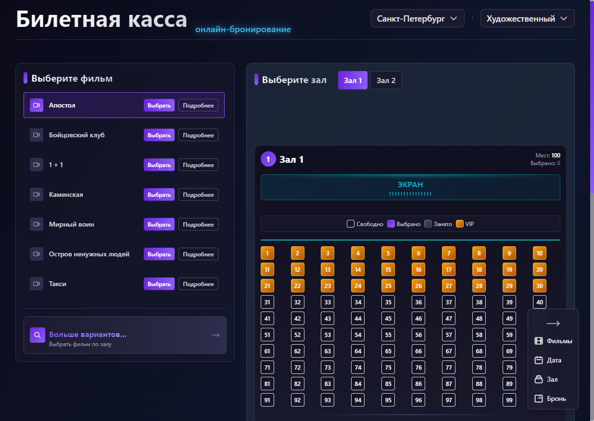
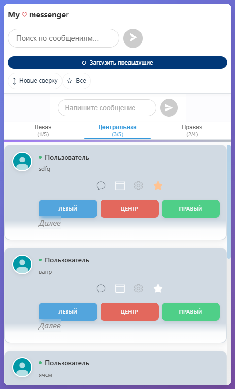
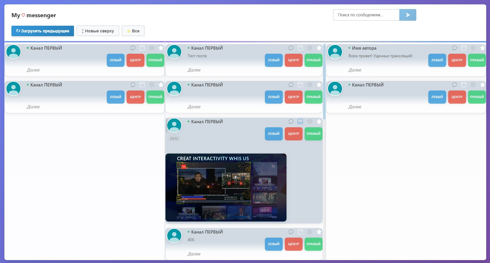
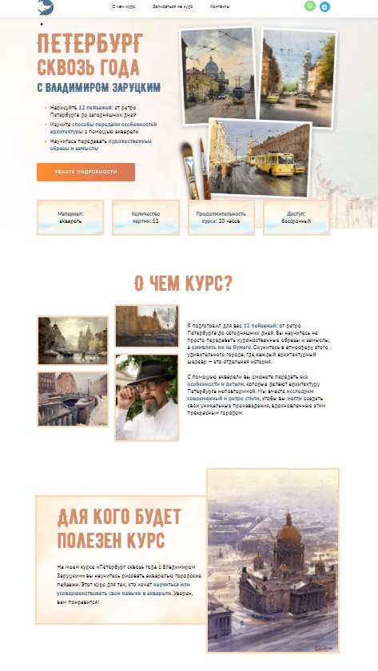
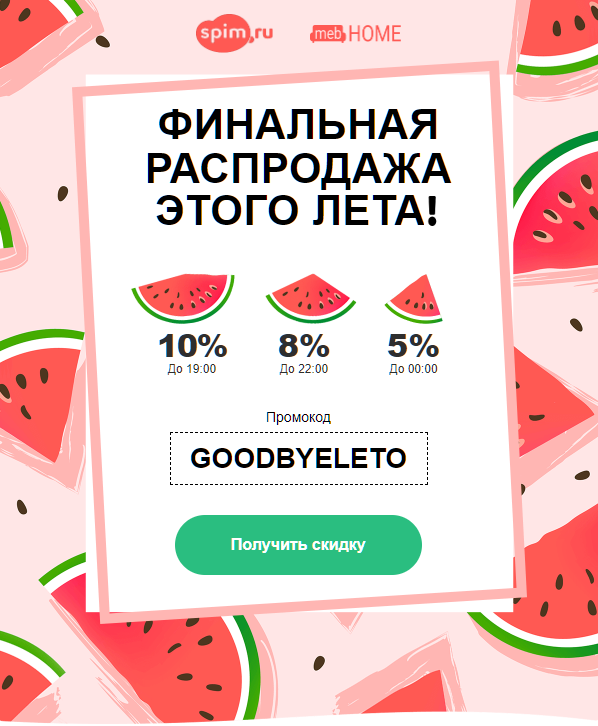

# Привет, я - Наталья Воробьева 👋

Я frontend‑разработчик с горящими глазами и багажом живого опыта.  
Да, мне 49 — и это мой козырь: я умею быстро учиться, доводить проекты до ума и не паникую в критических ситуациях.  
Сейчас активно ищу команду, где ценят профессионализм и человеческое отношение. Буду рада предложениям!

---

---

> «Код как приправа — лучше немного, но с душой»

---

## 🚀 Избранные проекты

### 🎟 Ticket Office — онлайн-бронирование билетов

Интерактивный сервис для выбора фильмов, дат и мест в кинотеатре с визуальной схемой зала, таймером бронирования и сохранением в localStorage.  
*React, Redux Toolkit, Tailwind, Vite*

🔗 [Демо](https://ticket-office-booking.vercel.app/) • [GitHub](https://github.com/Natalia-Vorobeva/ticket-office)

---

### 💬 Мессенджер с WebSocket и TypeScript

Трёхколоночный чат с real‑time синхронизацией, лайками, комментариями и базой данных PostgreSQL/SQLite.  
*React 19, TypeScript, Redux Toolkit, Socket.IO, Node.js, Express, SQLite*

🔗 [Демо](https://messenger-ts-websocket-unit.vercel.app) • [GitHub](https://github.com/Natalia-Vorobeva/messenger_ts_websocket_unit)

---

### 💬 Мессенджер Real-time (JavaScript)

Чат-приложение с комментариями и загрузкой файлов.  
*React, Node.js, PostgreSQL, Vercel*

🔗 [Демо](https://messenger-full.vercel.app/)

---

### 🎨 Лендинг о курсе акварели

Вёрстка и доработка существующего сайта с адаптивным дизайном.  
*React, jQuery, Bootstrap 4, Vite*

🔗 [Демо](https://petersburg-time-course.vercel.app/#about-course)

---

### ✉️ Адаптивное email-письмо

Кросс‑клиентский шаблон, корректно открывающийся в Outlook и на мобильных устройствах.  
*HTML, CSS, Email‑вёрстка, Outlook VML*

🔗 [Демо](https://natalia-vorobeva.github.io/email-final-discount/)

---

---

## 📫 Как со мной связаться

  

---

⭐️ Спасибо, что заглянули! Буду рада интересным задачам и тёплой атмосфере в команде.